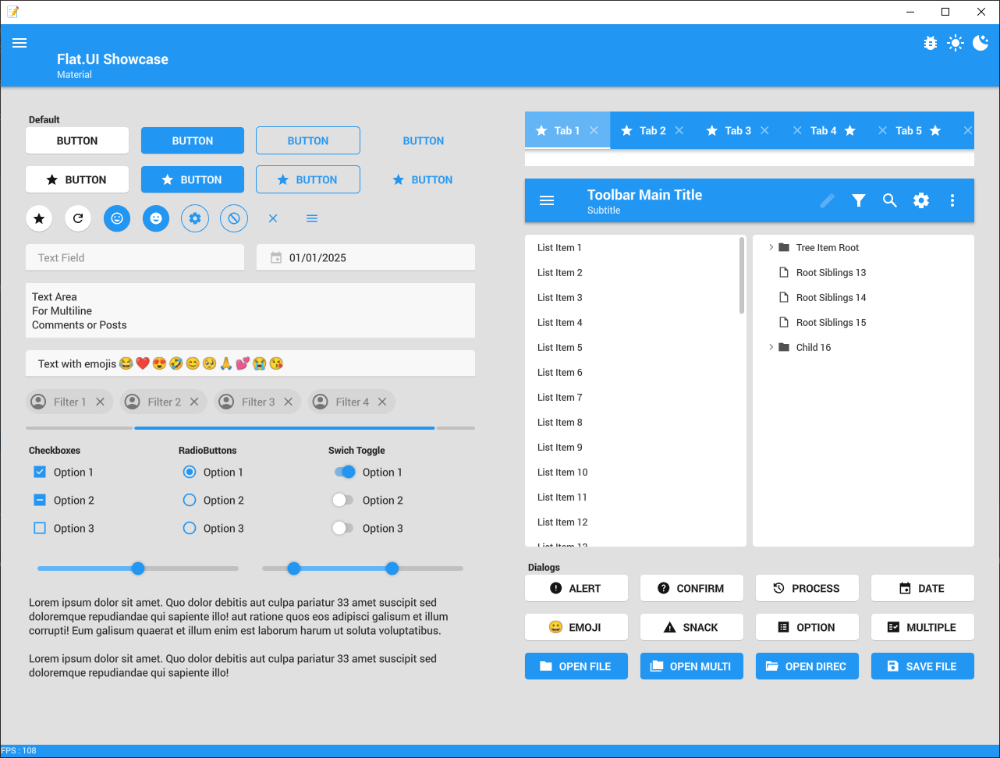

# Fuse.Flat


## Overview
Fuse.Flat is a library for material design UI development on Java. It also provides simple and indispensable set of tools for working with xml, themes, fonts, svg and images  

The main purpose is to work similar to HTML/CSS, but with solid and clear standards for styles.  


## Features

### Avaliable
 - All useful Material Design features
 - Fully customizable
 - Easy responsiveness
 - Direct access to OpenGL (Core)
 - Graphics Canvas (Easy to render shapes, text, colors, gradients and more)
 - Multiple Windows/OpenGL context support (Single Thread)
 - Localization / StringBundles
 - XML UI Reader
 - SVG support (render, icons, boolean operations)
 - TTF Font support (SDF)
 - Animations and Transforms
 - CSS-Like themes
 - Ready to Use Dialogs
 - Emojis 😁

### Getting started

The project starts when the first `Window` is created and launched.
A `Window` always have an `Activity` which is a bridge between `Window` and `Widget`
The Controller class will handle Activity events, and it should be extended. 
Controllers can also be used to control a `Dialog` and a `Frame`

The UXBuilder can assign variables and methods based upon widget's id. The field must be assigned with the annotation `@Flat`. All the fields will be assigned after the onLoad event.
```java
public class MainController extends Controller {
   @Flat 
   private Button button;

   @Override
   public void onShow() {
       button.setFollowStyleProperty("background-color", false);
       button.setBackgroundColor(Color.blue);
   }
   
   @Flat
   private void onButtonClick(ActionEvent event) {
       System.out.println("Hello World");
   }
}
```
UXML files are similar to XML. It is used for creating `Widgets`.
```XML
<Scene>
   <Button id="button" text="Print Hello World" on-action="onButtonClick"/>
</Scene>
```
The library is designed to work with MAVEN and a resources folders or even ZIP files.
```java
// For default MAVEN resource folder
Application.init();

// For zip as resource folder
Application.init(new ResourcesManager(new File("/file.zip")));

// For directory as resource folder
Application.init(new ResourcesManager(new File("/directory")));
```
It must be only one init for the project, and it should be the first thing to execute. As the example bellow.
The launcher also must happen only once.

```java
public static void main(String[] args) {
    Application.init();
    Application.setup(new WindowSettings.Builder()
            .layout("/default/screen_test/widgets.uxml")
            .theme("/default/themes/light")
            .stringBundle("/default/locale/english.uxml")
            .controller(MainController::new)
            .size(1280, 940)
            .multiSamples(8)
            .transparent(true)
            .build()
    );
    Application.launch();
}
```
A new Window can be created later using `Application.createWindow`

### Style-Properties and Attributes
All proprties have two names : CamelCaase for Java and kebab-case for CSS-Like and String

A Style-Property is a property that will change according to the current Style, Theme and Widget's State.
To set the Style-property manually, always `setFollowStyleProperty` to false.
Usually color, size, alignment, cursor, font and such are Style-Properties.

An Attribute is a value that can only be used on XML, and it will not change automatically after the Widget creation. So its value can be set freely.
Usually event listeners, text, adapters and such are Attributes.

#### Size
Widgets have 3 main size(X/Y/Width/Height) barriers:
- **Layout Box** : This is the total size that the widget occupies in its Parent, including margins.
This represents the safe space for drawing, even for the shadow.
The position X/Y is relative to the Parent
- **Out Box**: This is the size at which the widget can be visible, not including Margins, but including Padding.
The position X/Y is local, usually X=Margin-Left, Y=Margin-Top, but it can be distorted to less if the widget space is smaller.
- **In Box**: This is the size at which the main part of the Widget will be drawn, not including Padding or Margin.
The position X/Y is local, usually X=Margin-Left + Padding-Left, Y=Margin-Top + Padding-Top, but it can be distorted to less if the widget space is smaller.

The Layout size and position does not have a direct Style-Property, it is computed by the parent layout.
The `width`, `height`, `max-width`, `max-height`, `min-width`, `max-width` style-properties are only a prefered size for the **out box** limmit

The border simply does not affect the size.


#### Responsiveness
The `width`, `height`, `max-width`, `max-height`, `min-width`, `max-width` size Style-Properties are compatible to `WRAP_CONTENT` and `MATCH_PARENT`.
- **WRAP_CONTENT** will set the minimum possible comfortable size to render the widget.
- **MATCH_PARENT** will set the size to take up all the **remaining space** of its Parent. So all others widgets will have priority.
The widgets also have `weight` Style-Property so multiple MATCH_PARENT widgets can resolve the size.

Paddings and Margins properties will affect the final Layout/Out/In size independently
### Widgets

#### Layout
- Scene
- Panel
- LinearBox
- StackBox
- Grid
- Frame
- TabView
- Tab
- ScrollBox
- VerticalScrollBar
- HorizontalScrollBar
- Drawer

#### Text
- Label
- Button
- Chip
- TextArea
- TextField
- TextInputField
- TextDropDown

#### Image
- ImageView
- ProgressBar
- ProgressCircle

#### Forms
- Checkbox
- RadioButton
- RadioGroup
- Switch
- Slider
- RangedSlider

#### Structure
- ListView
- ToolBar
- ToolItem

#### Dialogs
- Menu
- MenuItem
- Divider

### UXML (XML-Like)
The UXML should have only one root.

#### Scene
The UXML for the Activity should always start with a `Scene`. If not, it will be wrapped with a new `Scene`.

#### Children
Some Widgets, like Scene, LinearBox, ScrollBox and such can have children widgets:
````XML
<Scene>
   <LinearBox direction="HORIZONTAL">
      <Button text="Hello World 1"/>
      <Button text="Hello World 2"/>
   </LinearBox>
</Scene>
````
Some Widgets only allow sone specific type for children:
- `TabView` : Can only have `Tab`
- `Menu` : Can only have `MenuItem` and `Divider`
- `ToolBar` : Can only have `ToolItem`

`Tab` will wrap all the children into a `Frame` (only if the children is not already a `Frame`)

#### Context Menu
All widgets can have a default context menu as `hello_world.uxml`
````XML
<Button text="Hello World">
   <Menu>
      <MenuItem text="Click-Me"/>
   </Menu>
</Button>
````
If a `MenuItem` has a Context Menu, it will become a SubMenu.
If a `ToolBar` has a Context Menu, it will become the Overflow-Item default menu.

#### Include
The UXML also accepts `<Inclue src="/file/path"/>`. Properties on the tag will be assigned to the included file first tag.

````XML
<Include src="hello_world.uxml" background-color="red"/>
````
Wich is the same as
````XML
<Button text="Hello World" background-color="red">
   <Menu>
      <MenuItem text="Click-Me"/>
   </Menu>
</Button>
````
#### Style
All widgets can have multiple styles. The last style will have priority. The parent style **DOES NOT** affect the children.
````XML
<Scene>
   <Button text="Hello World" style="red round floating"/>
</Scene>
````

### UXSS (CSS-Like)
All widgets start with a camel-case default style of it's class name.

The UXSS style has some key features
- A style can inherite other style
- All styles can have state specific values
- A override value on the devired style will replace all parents values of the same property
- A Style-property set on the UXML will override all values for all states

````CSS
parent {
    background-color : red;
    hover {
         background-color : #800000;
    }
}
style : parent {
    padding-top : 16;
    pressed {
         background-color : #800000;
    }
}
````

#### Values
- `Size` : `dp` `sp` `in` `cm` `mm` `px` `pc`
  - `dp` : has a value to specific DPI constraints, so it can match good pixel values in the same time it is responsive
  - `sp` : same as `dp`, but the theme can have a Font Size multiplier
  - `in` `cm` `mm` `pc` : has the real world size, no rouding DPI
  - `px` or number only : pixel value
  - `MATCH_PARENT`, `WRAP_CONTENT` : use only for width/heigh
- `Size List` : as function with any paremeter count `list(10, 10dp, match_parent)`
- `Color` : 
  - `#FFFFFF` : rgb hexadecimal
  - `#FFFFFFFF` : rgba hexadecimal
  - `rgb(255, 255, 255)` : rgb decimal color
  - `rgba(255, 255, 255, 1.0)` : rgb decimal color and alpha channel
  - `alpha(color-or-variable, 1.0)` : alpha modifier
  - `color-name` : basic colors name (same as css)
- `Font` : as function `font("Arial", BOLD, ITALIC)`. The order does not matter. It can only have one Family, one Weight, one Style and one Posture (For now)
  - Style : `SANS`, `SERIF`, `MONO`, `CURSIVE`, `EMOJI` 
  - Weight : `NORMAL`, `MEDIUM`, `SEMI_BOLD`, `BOLD`, `LIGHT`, `EXTRA_BOLD`, `EXTRA_LIGHT`, `BLACK`, `THIN`
  - Posture : `REGULAR`, `ITALIC`
- `Text` or `Constant` : simple write the plain text or use quots for spaces and special characters. Constants are case-insensitive
- `Resource` : simple write the path as `'/path/to/image.svg'`
- `Variable` : `$variable`. The variable name is case-sensitive. It does not need to follow the java rules for variables names. A variable can have any value. It must have a default value. The variable value can be set at runtime.
- `Localization` : `@stringbundle`. It will search on StringBundles, and it will update if the language changes at runtime
- `Icon` : `icon(bundle, icon_name)`. It will search a installed icon. There are 3 installed bundles by default : fill, outline, emoji
- `Alpha` : `alpha(color, 0.5)`. Create a color with a multiplied alpha. It can use variables

````CSS
$var-name : 10dp;
$var-color : #FFFFFF;

style {
   size : 10dp;
   size-list : list(10px, 10mm, 10pc, 10dp);
   color : #FF00FFFF;
   color-name : red;
   font : font(SANS);
   font-arial-italic : font("Arial", ITALIC);
   text : "Quoted because I have spaces";
   constant : MaTcH_PaReNt;
   image-resource-1 : "/default/path/to/icon.svg";
   image-resource-2 : '/simple/quots/also/works.png';
   variable : $var-name;
   localized-text : @title.content;
   image : icon(fill, star);
   color-alpha : alpha($var-color, 0.5);
}
````

#### Include
UXSS themes can be a individual uxss file or a folder. An UXSS theme can include other theme.

````CSS
@include '../other/theme';
````

### Todo - List
- [ ] Wiki
- [ ] Pickers
   - [ ] Color Picker
   - [ ] Font Picker
- [ ] Add "paint" to all "color" css-like styles
